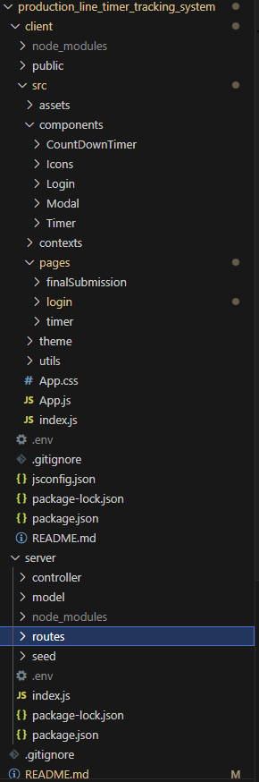
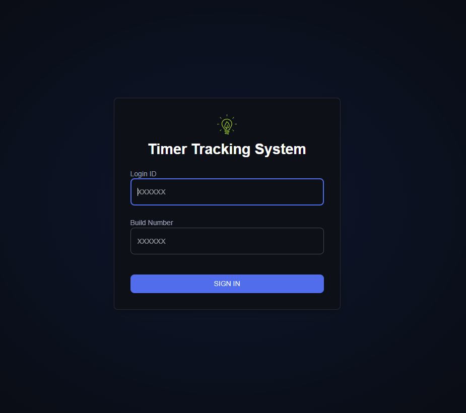
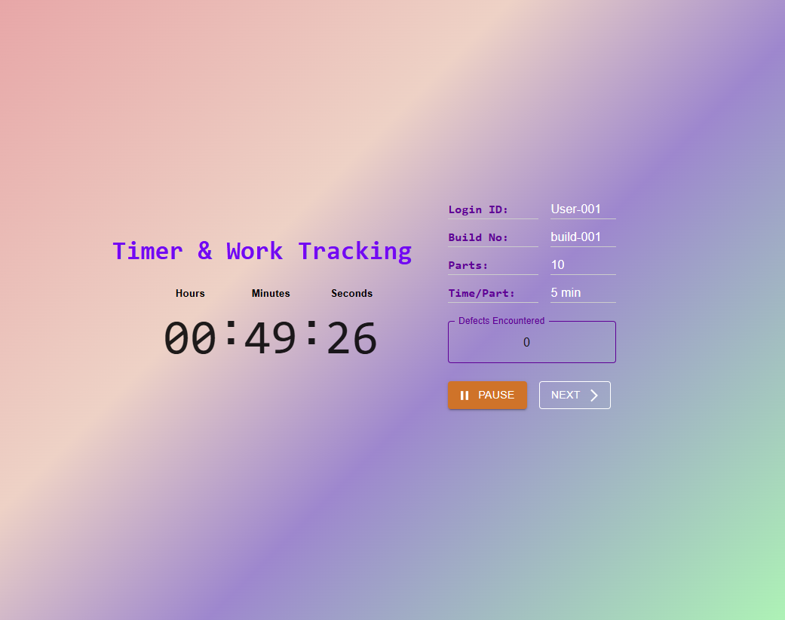
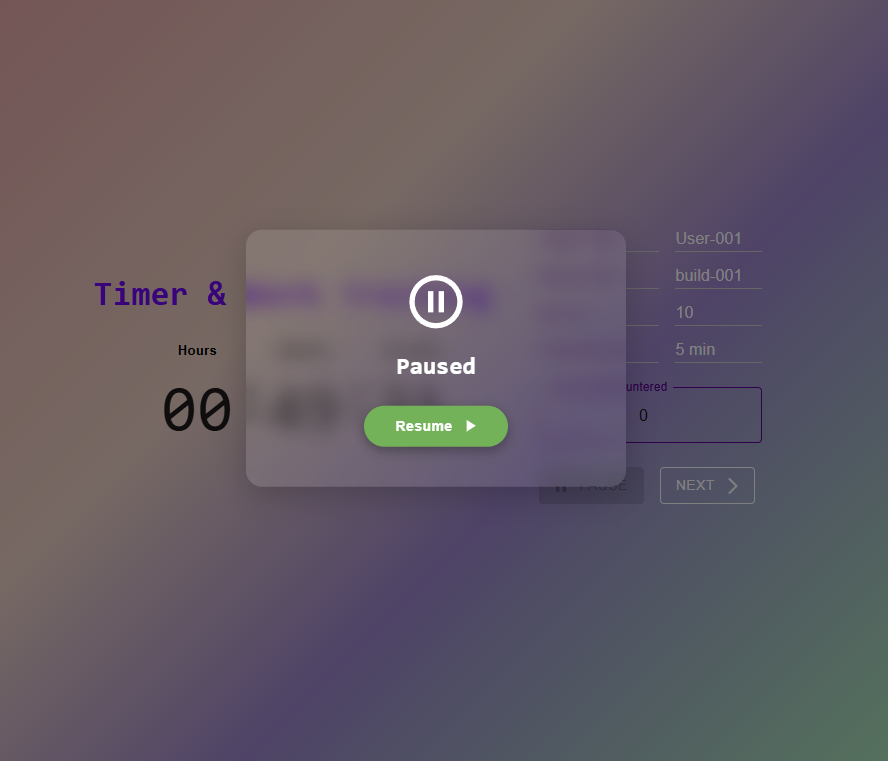
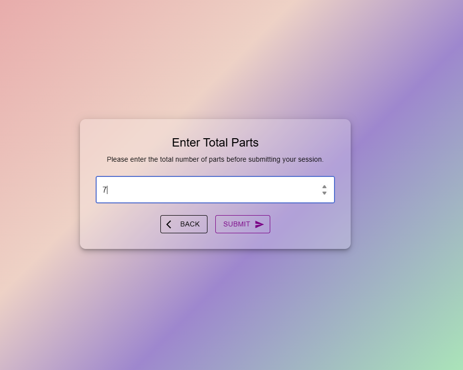
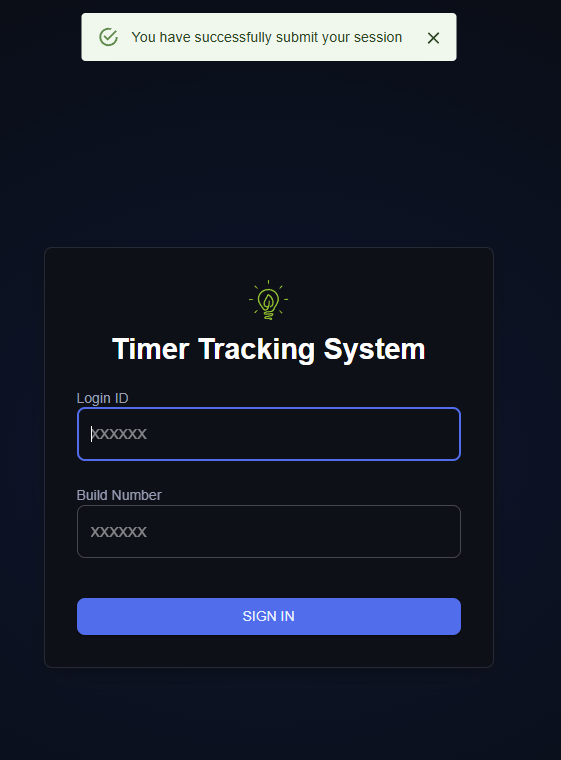

# Production Line Timer Tracking System

## Project Description

The Timer Tracking System is a full-stack web application designed to manage and monitor production build processes efficiently. Users can log in using a unique Build Number and Login ID to track time per part, manage build data, and ensure accurate production metrics.

The system features:
- A **React (MUI)** frontend with a user-friendly interface.
- A **Node.js / Express** backend serving RESTful APIs.
- **MongoDB** as the primary database for build and session records.
- Custom validation ensuring only valid build numbers and login IDs can access tracking functionality.

## Assumptions and Decisions

### General Assumptions
- The `loginId` is the primary key for retrieving and resuming sessions.
- Only one active session per user (`loginId`) exists at a time.
- Session persistence must survive browser refreshes, closures, or clearing cache/localStorage by storing only the `sessionId` and refetching session data from the backend.
- Timer reflects real-world production time and pauses/unpauses must be accurately tracked.
- Popup interactions count as pause events with special handling.
- The user interface should be simple and avoid unnecessary complexity.
- When auto-submit defects and total parts should not be updated, since data is not accurate besides the time
- If user back to system within 10 mins after normal working time is up, user still have chance to confirm popup interaction to continue to work
- All popup interaction session will consider as inactive time

---

### Page One - SignIn Page

**Assumptions:**
- When a user logs in, if an active session exists with the same `loginId` (even if the `buildNumber` is different), resume the existing session.
- Users may want to switch their selected build or login ID after submitting.

**Decision:**
- Provide a **Back** button on the information display page after login submission.

**Reasoning:**
- Some builds are role-specific, so switching builds may require changing the login ID as well.
- Allowing inline toggling of login ID or build on the information display page would complicate the UI unnecessarily.
- A Back button offers a quick, clear way to switch builds or login IDs without adding complexity.

---

### Page Two - Counting Down Timer Page

**Assumption:**
- If the user stops work by closing the browser or deleting localStorage data, upon return, the interface should restore exactly to the previous state (e.g., paused if paused).

---

### Popup Interaction and Pause Logic

- Popup appearance triggers a pause event flagged as `isPopupInteraction`.
- The time from popup showing until clicking "Yes" is inactive time (paused).
- Clicking "No" triggers a pause until user resume work.
- No interaction before popup timeout triggers auto-submit and session reset.
- Popup interactions create records with timestamps for monitoring and recovery.
- Popup reschedules are isolated timers, repeating every 10 minutes after user interaction.

---

### Page Three - Final Submission Page

- Accessible only when user previous popup interaction clicking "Yes" button or clicking Next on Page Two. If user click Yes button, they allowed to access submission using url. 
- Countdown timer does not pause on this page to reflect real production time.
- User can enter final total parts, go back to Page Two (preserving data and timer), or submit to save session and reset.


## Architecture and Technical Decisions


## Project Architecture Overview

The project is organized into two main folders at the root level: `client` and `server`. This separation clearly distinguishes the frontend and backend codebases, enabling focused development, easier maintenance, and better scalability.

---

### Client (Frontend)

The `client` folder contains the React application, structured as follows:

- **pages**  
  Contains individual page components representing different views/screens in the app. Each page can compose and render various smaller components as needed. This separation makes routing and page-level state management easier.

- **components**  
  Reusable UI components that can be shared across multiple pages, promoting DRY (Don't Repeat Yourself) principles and consistent UI.

- **contexts**  
  Provides React Contexts for global state management such as authentication status and other shared variables. This allows centralized control of state and simplifies passing props through the component tree.

- **theme**  
  Defines the Material UI theme configurations like colors, typography, and spacing to ensure a consistent design language throughout the app.

- **utils**  
  Contains utility functions, including the Axios API call setup. The API helper dynamically sets the backend server domain based on environment or deployment, avoiding hardcoded URLs and improving flexibility.

This modular client structure supports maintainability, scalability, and clear separation of concerns between UI, state, and utilities.

---

### Server (Backend)

The `server` folder contains the Node.js Express backend, structured into:

- **controllers**  
  Handle business logic and request processing. They receive requests from routes, process data, and respond accordingly.

- **models**  
  Define MongoDB schemas and data models, enabling interaction with the database in an organized way.

- **routes**  
  Define API endpoints and route requests to the appropriate controllers, keeping routing concerns separated from business logic.

- **seed**  
  Contains scripts to seed initial or test data into the database, facilitating easier development and testing.

This clear MVC-like backend architecture improves code organization, testability, and separation of responsibilities between routing, business logic, and data modeling.

---

### Why This Architecture?

- **Separation of Concerns:** Dividing frontend and backend enables independent development and deployment pipelines.
- **Maintainability:** Modular folder structure makes it easier to find, update, and debug specific parts of the application.
- **Scalability:** Adding new features, pages, or API endpoints fits naturally into this well-defined structure.
- **Reusability:** Shared components and utility functions encourage code reuse and consistent design patterns.
- **Flexibility:** Dynamic API domain handling in the client allows seamless environment switching (development, staging, production).

This architecture follows common best practices in modern full-stack web development and ensures a clean, maintainable, and scalable codebase.


## Technical Stack Consideration

### Countdown Library for Animation

I tried to chose a countdown library to provide smooth and visually appealing timer animations that enhance user experience. However, since the library lacks support for features like negative values (e.g., showing overtime), so I created custom count down timer component.

### Material UI as Frontend UI Library

Material UI (MUI) is selected for its rich set of pre-built React components that follow Google’s Material Design guidelines:

- Speeds up frontend development with ready-to-use, well-designed UI elements.
- Ensures accessibility and responsiveness out-of-the-box.
- Allows for easy customization to match our project’s branding and style requirements.
- Provides consistent UI/UX which is crucial for user trust and usability in a production tracking environment.

### MongoDB for Database

MongoDB is chosen as the database because:

- The project requires flexible, user-specific session data storage where schema may evolve over time.
- Its document-based structure fits naturally with JSON-like session and popup interaction data.
- Allows efficient querying and updating of nested session records and build data.
- Perfect for applications with rapidly changing or complex data models like production tracking sessions.

## Setup Instructions

### Prerequisites
* Node.js (I am using version v22.18.0)
* MongoDB (Local or Cloud - e.g., MongoDB Atlas, I am using local version with Compass)
* npm (should be installed when you install Node)

### Clone the Repository And Install Dependency
```bash
git clone https://github.com/cyang258/production_line_timer_tracking_system.git
cd production_line_timer_tracking_system
```

**Now you need to install Dependency, open another terminal, so you have one for client and one for server**

*in client:*

```bash
cd client
npm install
```

*in server:*

```bash
cd server
npm install
```

### Environment File

If you already have MongoDB installed, create a new database and add your MongoDB connection string to the `.env` file.

Example `.env` file:

```env
MONGO_URL=mongodb://localhost:27017/your-database-name
PORT=8000
```

### Seeding Database

To seed initial build data into the database you have setup the MongoDB and env file first.
After setup env go to main folder and do following:

```bash
cd server
npm run seed
```

## Runing the application

Open two terminal, and navigate to server and client folder respectively

*in client:*

```bash
npm run dev
```

*in server:*

```bash
npm run start
```
## 📸 Project UI Overview

Below is a walkthrough of the main user interface flow for the **Production Line Timer Tracking System**.

### 1️⃣ Login


### 2️⃣ Information Page


### 3️⃣ Countdown Page


### 4️⃣ Pause


### 5️⃣ Submission Page


### 6️⃣ Successful Manual Submission


## Conclusion

The **Production Line Timer Tracking System** is designed to provide an accurate, user-friendly, and efficient way to track production times and manage session data in a manufacturing environment.  
Its clear separation of frontend and backend, robust pause/resume logic, and persistent session handling make it well-suited for real-world production tracking needs.  

Future enhancements could include advanced analytics dashboards, role-based access control, and multi-language support to further expand its usability.  

Feel free to explore the repository, open issues, or suggest improvements — contributions are always welcome!